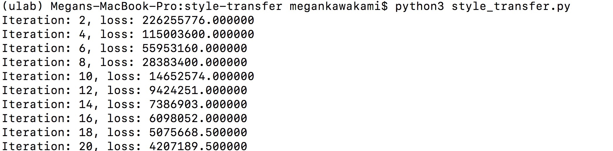
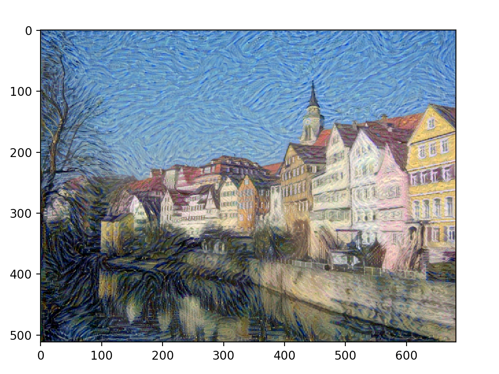

# Computer Vision - Style Transfer
I worked on this project with the Statistical Modeling and Deep Learning Lab in Undergraduate Lab at Berkeley.  

We constructed a convolutional neural network using PyTorch to identify objects in images. Using this, we then synthesized a texture from a Van Gogh artwork while preserving the content of our base image.

# Original Images
Content Image:

Style Image:

# Visualization / Results
After running style_transfer.py on our images, we can see our minimization of loss with each iteration of gradient descent.  This convolutional network resulted in the image shown below.

